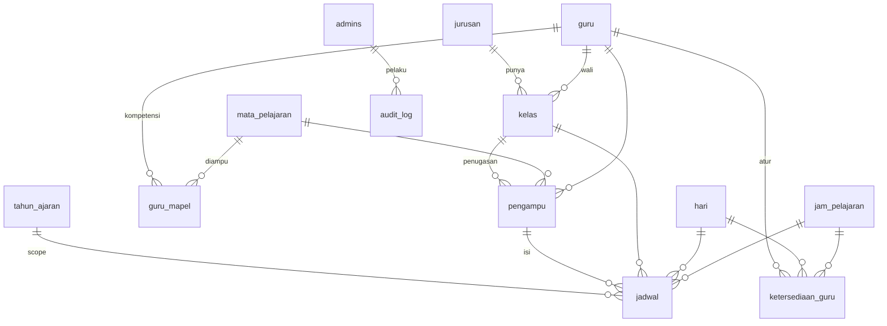

# Desain Sistem Penjadwalan KBM — SMK Bina Nusa

> Modul lanjutan dari aplikasi "Kesediaan Guru Mengajar".
> Stack: **CodeIgniter 4.7 · PHP 8.2 · MySQL · Tailwind CSS · Alpine.js · SortableJS · dompdf · PhpSpreadsheet**.
> Target deploy: **shared hosting** (cache handler `file`, query ber-index, hindari N+1).
>
> Status: **DESAIN — menunggu persetujuan sebelum coding.**

---

## Keputusan Teknis

| Topik | Keputusan |
|---|---|
| UI | Tailwind + Alpine.js (konsisten dgn app lama). Drag-drop = SortableJS, Ajax = `fetch()` |
| Auto-Generate Jadwal | Dikerjakan di **fase akhir** setelah pondasi solid |
| Git | Claude **tidak** commit/push. Semua git ditangani user via GitHub Desktop |
| Soft delete | Dipakai utk master data; tabel `jadwal` pakai hard delete (krn ada UNIQUE slot) |

---

## 1. Daftar Menu Aplikasi

```
PANEL KURIKULUM
├── Dashboard Kurikulum            (statistik + grafik)
├── MASTER DATA
│   ├── Guru                       (CRUD, import/export Excel)
│   ├── Mata Pelajaran             (CRUD, import Excel)
│   ├── Kelas / Rombel             (CRUD)
│   ├── Jurusan                    (CRUD)
│   ├── Hari                       (master statis)
│   ├── Jam Pelajaran              (CRUD per shift)
│   ├── Pengampu / Penugasan       (guru x mapel x kelas + JP)
│   └── Ketersediaan Guru          (set hari/jam tersedia)
├── PENJADWALAN
│   ├── Jadwal KBM                 (grid mirip Excel + drag-drop)
│   ├── Generate Otomatis          (fase akhir)
│   └── Deteksi Bentrok            (laporan bentrok guru/kelas)
├── LAPORAN
│   ├── Rekap Beban Mengajar       (per guru, total JP)
│   ├── Jadwal per Kelas           (export PDF/Excel)
│   └── Jadwal per Guru            (export PDF/Excel)
├── SISTEM
│   ├── Audit Log
│   └── Pengaturan Sekolah         (sudah ada)
└── [lama] Data Kesediaan Guru · Profil
```

---

## 2. Analisis Kebutuhan

### Kebutuhan Fungsional
| Kode | Kebutuhan | Prioritas |
|---|---|---|
| FR-01 | CRUD + Import/Export Excel Master Guru | Tinggi |
| FR-02 | CRUD + Import Excel Master Mapel | Tinggi |
| FR-03 | CRUD Master Kelas (tingkat, jurusan, wali, shift) | Tinggi |
| FR-04 | Master Hari & Jam Pelajaran per shift | Tinggi |
| FR-05 | Set Ketersediaan Guru | Tinggi |
| FR-06 | Input jadwal manual per sel | Tinggi |
| FR-07 | Drag-drop pindah/tukar jadwal tanpa reload | Tinggi |
| FR-08 | Validasi real-time 4 aturan bentrok | Kritis |
| FR-09 | Rekap beban mengajar otomatis | Tinggi |
| FR-10 | Deteksi bentrok menyeluruh | Tinggi |
| FR-11 | Dashboard statistik + grafik | Sedang |
| FR-12 | Export PDF & Excel | Tinggi |
| FR-13 | Generate jadwal otomatis | Sedang (fase akhir) |
| FR-14 | Soft delete + Audit log | Sedang |

### Aturan Validasi (Rule Engine)
| Aturan | Definisi | Aksi |
|---|---|---|
| R1 Bentrok Guru | 1 guru tak boleh 2 kelas di hari+jam sama | Tolak |
| R2 Bentrok Kelas | 1 kelas tak boleh 2 mapel di slot sama | Tolak |
| R3 Ketersediaan | Guru tak tersedia di slot itu | Tolak |
| R4 Kuota JP | Total JP terjadwal harus = JP penugasan | Peringatan |

### Kebutuhan Non-Fungsional
| Kode | Kebutuhan |
|---|---|
| NFR-01 | Query ber-index, hindari N+1, tanpa SELECT * di list besar |
| NFR-02 | Cache (file) utk grid jadwal, rekap, dashboard + invalidasi otomatis |
| NFR-03 | Prepared statement (Query Builder), pconnect off |
| NFR-04 | Soft delete master data |
| NFR-05 | Audit log (siapa-kapan-aksi-tabel) |
| NFR-06 | FK lengkap + normalisasi 3NF |
| NFR-07 | Transaksi DB saat import/generate massal (rollback bila gagal) |

---

## 3. ERD



**Konsep penting:** `guru_mapel` = kompetensi (guru BISA mengajar mapel). `pengampu` = penugasan nyata (guru MENGAJAR mapel di kelas X sekian JP) → sumber kuota JP & isi sel jadwal.

---

## 4. Struktur Tabel MySQL

Lihat DDL lengkap di lampiran bawah dokumen. Ringkasan 12 tabel baru:

| # | Tabel | Fungsi |
|---|---|---|
| 1 | tahun_ajaran | Scope semester |
| 2 | jurusan | Master jurusan |
| 3 | guru | Master guru |
| 4 | mata_pelajaran | Master mapel |
| 5 | kelas | Master kelas/rombel |
| 6 | hari | Master hari |
| 7 | jam_pelajaran | Master jam (per shift) |
| 8 | guru_mapel | Pivot kompetensi |
| 9 | ketersediaan_guru | Hari/jam tersedia guru |
| 10 | pengampu | Penugasan guru-mapel-kelas + JP |
| 11 | jadwal | Isi tiap sel grid |
| 12 | audit_log | Jejak aktivitas |

---

## 5. Relasi Tabel
| Dari | Ke | Tipe | On Delete |
|---|---|---|---|
| kelas.jurusan_id | jurusan.id | N:1 | SET NULL |
| kelas.wali_kelas_id | guru.id | N:1 | SET NULL |
| guru_mapel | guru / mata_pelajaran | N:M | CASCADE |
| ketersediaan_guru | guru / hari / jam | N:1 | CASCADE |
| pengampu | kelas / mapel / guru | N:1 | CASCADE |
| jadwal.pengampu_id | pengampu.id | N:1 | CASCADE |
| jadwal | kelas/hari/jam/guru/tahun_ajaran | N:1 | mixed |
| audit_log.admin_id | admins.id | N:1 | SET NULL |

---

## 6. Flowchart Proses Penjadwalan

### 6a. Input/Pindah Jadwal Manual (drag-drop)
```
[Admin tarik kartu mapel ke sel kosong/isi]
        │
        ▼
[Ajax POST /jadwal/simpan  {kelas,hari,jam,pengampu}]
        │
        ▼
[Validasi server]
  ├─ R2: sel kelas sudah terisi? ───── ya ─► [Tolak: "Kelas bentrok"]
  ├─ R1: guru sudah ngajar di slot? ── ya ─► [Tolak: "Guru bentrok"]
  ├─ R3: guru tersedia? ───── tidak ─► [Tolak: "Guru tidak tersedia"]
  └─ semua lolos
        │
        ▼
[Simpan + tulis audit_log + hapus cache grid]
        │
        ▼
[Return JSON ok] ─► [UI update sel tanpa reload]
        │
        ▼
[Hitung ulang sisa JP penugasan → R4 badge kurang/pas/lebih]
```

### 6b. Generate Otomatis (fase akhir)
```
[Pilih kelas/tahun ajaran] ─► [Ambil daftar pengampu (mapel+guru+JP)]
        │
        ▼
[Urutkan: JP terbesar & guru paling sibuk dulu (most-constrained first)]
        │
        ▼
[Loop tiap penugasan, tiap JP yg dibutuhkan]
        │
        ▼
[Cari slot kosong yg lolos R1,R2,R3] ── ketemu ─► [Tempatkan]
        │ tidak ketemu
        ▼
[Backtrack / tandai "gagal sebagian" + laporan slot bentrok]
        │
        ▼
[Commit transaksi bila sukses / rollback bila batal] ─► [Tampil hasil + sisa konflik]
```

---

## 7. Wireframe Halaman

### 7a. Jadwal KBM (grid)
```
┌──────────────────────────────────────────────────────────────┐
│ Jadwal KBM   [Shift: Pagi ▼] [Kelas: X TKJT 1 ▼] [TA 26/27 ▼] │
│              [Simpan otomatis ✔]  [Export PDF] [Export Excel]  │
├──────────┬──────────────────────────────────────────────────  │
│ PALET    │  HARI/JAM   │ Senin │ Selasa │ Rabu │ Kamis │ Jumat │
│ MAPEL    │  Jam 1 07.00│ [PD]  │  [B.Ind│ ...  │       │       │
│ (drag)   │  Jam 2 07.35│ [PD]  │        │      │       │       │
│ ┌──────┐ │  Jam 3 08.10│ [Mat] │        │      │       │       │
│ │ PD 8 │ │  Jam 4 08.45│       │        │      │       │       │
│ │ Mat 4│ │  ISTIRAHAT  ════════════════════════════════════    │
│ │ B.Ind│ │  Jam 5 09.40│       │        │      │       │       │
│ └──────┘ │  ...        │       │        │      │       │       │
│ sisa JP: │             │       │        │      │       │       │
│ PD 6/8   │  Sel bentrok ditandai merah, valid hijau            │
└──────────┴──────────────────────────────────────────────────  │
```

### 7b. Rekap Beban Mengajar
```
┌───────────────────────────────────────────────┐
│ Rekap Beban Mengajar     [Export PDF] [Excel]  │
├───────────────────────────────────────────────┤
│ Guru          │ Mapel        │ Kelas │ JP      │
│ Muslimin,S.Kom│ Pemrog Dasar │ X-1   │ 8       │
│               │ ASJ          │ XI-1  │ 18      │
│               │ ─ TOTAL ─    │       │ 26 / 24 │ ◄ lebih (merah)
│ Maya, S.Pd    │ ...          │       │ 12 / 24 │ ◄ kurang (kuning)
└───────────────────────────────────────────────┘
```

### 7c. Dashboard Kurikulum
```
┌─────────┬─────────┬─────────┬─────────┐
│ 35 Guru │ 24 Kelas│ 40 Mapel│ 980 JP  │
├─────────┼─────────┼─────────┼─────────┤
│ 3 Bentrok (merah) │ 5 Kurang Jam │ 2 Lebih Jam │
└───────────────────┴──────────────┴─────────────┘
[Grafik batang: beban per guru]   [Grafik: pemenuhan JP per kelas]
```

---

## 8. Rencana Pengerjaan Step-by-Step (Fase)

> Tiap fase = satu unit kerja yg bisa di-review & di-commit user sendiri.

| Fase | Isi | Output |
|---|---|---|
| **F0** | Migration semua tabel + seeder (hari, jam, jurusan) | DB siap |
| **F1** | Master Jurusan + Hari + Jam Pelajaran (CRUD) | 3 master dasar |
| **F2** | Master Guru (CRUD + import/export Excel) | + import dari `submissions` |
| **F3** | Master Mata Pelajaran (CRUD + import) + guru_mapel | kompetensi |
| **F4** | Master Kelas + Pengampu (penugasan + JP) | siap dijadwal |
| **F5** | Ketersediaan Guru | data R3 |
| **F6** | Jadwal KBM grid + drag-drop + Rule Engine (R1–R4) | inti sistem |
| **F7** | Deteksi Bentrok + Rekap Beban + Dashboard | laporan |
| **F8** | Export PDF & Excel (jadwal kelas/guru, rekap) | cetak |
| **F9** | Audit Log + integrasi menu sidebar | rapi |
| **F10** | Generate Jadwal Otomatis | fitur pamungkas |

Setiap fase: Model → Controller → Routes → View → uji singkat → lapor ke user untuk commit.

---

## 9. Strategi Cache (shared hosting, handler `file`)

| Data | Key cache | TTL | Invalidasi saat |
|---|---|---|---|
| Grid jadwal per kelas | `grid_jadwal_{kelas}_{ta}` | 1 jam | simpan/pindah/hapus jadwal kelas itu |
| Rekap beban guru | `rekap_beban_{ta}` | 1 jam | jadwal/pengampu berubah |
| Angka dashboard | `dash_kurikulum_{ta}` | 30 mnt | jadwal/master berubah |
| Daftar dropdown master | `opt_guru`, `opt_mapel`, `opt_kelas` | 6 jam | CRUD master terkait |

Pola: helper `cache_forget_jadwal($kelas_id,$ta)` dipanggil tiap mutasi. Hindari menyimpan objek besar; simpan array hasil query siap-render saja.

---

## Lampiran — DDL Lengkap

Lihat blok SQL pada riwayat desain (Batch B). Akan diterjemahkan ke CI4 Migrations pada Fase F0.
